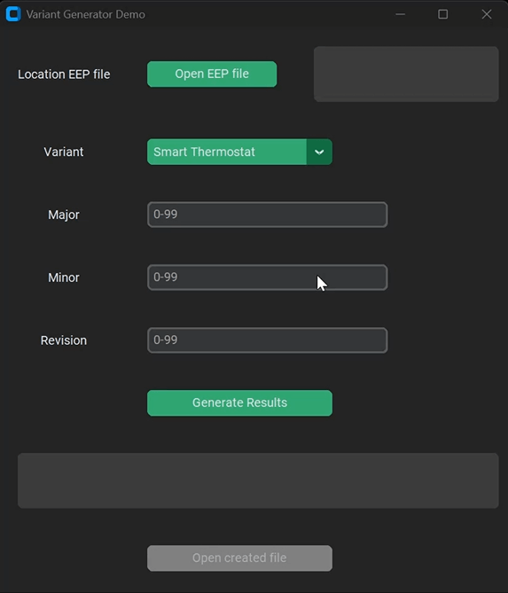

# CustomTkinter Variant File Generator

## Overview

GUI application designed to facilitate the generation of variant files. Built using the CustomTkinter library, this application allows users to select EEP files, specify variant details, and generate corresponding .MOT files with ease.

## Demo

## Features

- **User-Friendly Interface**: Utilizes CustomTkinter for a modern and responsive GUI.
- **File Selection**: Easily select EEP files through a file dialog.
- **Variant Configuration**: Input fields for specifying major, minor, and revision numbers.
- **Automated File Generation**: Executes batch commands to generate .MOT files based on user inputs.
- **Change Logging**: Maintains a ChangeLog.txt file to track all generated files and commands executed.
- **Error Handling**: Provides clear error messages and feedback to users.

### Prerequisites

- Python 3.x
- [CustomTkinter library](https://github.com/TomSchimansky/CustomTkinter)

## Important Note

To execute the `.mot` file via the generated executable, ensure that the `demo_writeheader.bat` file is located in the same directory as the executable. This batch file is necessary for processing and generating the `.mot` file correctly.

## Usage

- Launch the application and use the "Open EEP file" button to select your EEP file.
- Choose a variant from the dropdown menu and specify the major, minor, and revision numbers.
- Click "Generate Results" to create the .MOT file.
- View the generated file by clicking "Open created file" once the process is complete.

## License

This project is licensed under the MIT License - see the [LICENSE](LICENSE) file for details.